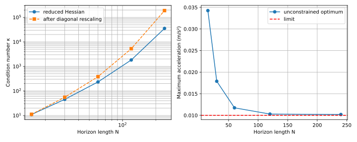

# Spacecraft Rendezvous and Long-Horizon Conditioning

## 1. Problem identification and motivation

This project studies how a chaser spacecraft can rendezvous with a target in circular
low Earth orbit. It also examines whether increasing the control horizon produces an
intrinsically large condition number κ that slows single-shooting gradient descent.

## 2. Formulation

The authoritative mathematical formulation is [docs/formulation.md](docs/formulation.md).
The design decision variables are the three-axis acceleration commands over a uniform
zero-order-hold grid. The implementation supports exact rendezvous, tolerance-based
rendezvous, acceleration magnitude bounds, and componentwise acceleration bounds.

## 3. Condition number κ mechanism

In single shooting, early controls affect every later state through repeated powers of
the CW state-transition matrix. Substitution into the path-state objective creates a
dense reduced Hessian. The intended Family I test increases horizon length at fixed
sample time and checks whether its condition number κ grows and survives diagonal
rescaling.

## 4. Effect on the baseline

The four-interval cross-track reduction provides the independent small-matrix check. Its
reduced Hessian is

```text
[[399390.828621, -36656.773110],
 [-36656.773110, 500873.213215]]
```

The analytic quadratic-form eigenvalues are `387534.995345` and `512729.046491`; they
match `numpy.linalg.eigvalsh` with maximum relative error `1.50e-16`.

The approved experiment was required to keep the `0.01 m/s²` acceleration bound
inactive so that null-space-reduced gradient descent would solve the same physical
problem without projection or a penalty term. The deterministic preflight found that
the exact-rendezvous optimum exceeds that limit for every approved horizon. Results are
written to `outputs/report/conditioning_preflight.csv`.

| N | Final time (s) | Condition number κ | After diagonal rescaling | Maximum acceleration (m/s²) |
|---:|---:|---:|---:|---:|
| 15 | 300 | 10.97 | 11.13 | 0.03426 |
| 30 | 600 | 45.51 | 55.38 | 0.01789 |
| 60 | 1200 | 233.62 | 383.46 | 0.01174 |
| 120 | 2400 | 1834.79 | 5280.36 | 0.01029 |
| 240 | 4800 | 35474.58 | 189405.40 | 0.01019 |



Following the approved failure policy, no D3 convergence curve is claimed and the
parameters were not automatically changed.

## 5. Proposed solution and demonstration

The implemented remedy is a sparse multiple-shooting Karush–Kuhn–Tucker Newton solve,
cross-checked against the complete CVXPY/Clarabel constrained formulation. A D4 claim is
deferred because the baseline diagnostic did not pass its inactive-bound prerequisite.

The separate complete constrained demonstration at `N=60` is feasible and optimal. It
has objective `2634.273652`, maximum physical dynamics defect `8.53e-14`, terminal
position residual `1.13e-14 m`, terminal velocity residual `1.93e-16 m/s`, and maximum
control-bound violation `4.49e-10 m/s²`, below the confirmed `1.0e-9 m/s²` allowance.
The deterministic zero-control case is reported as infeasible and exports no course.

## 6. Assumptions and simplifications

The implementation assumes circular two-body motion, small relative separation, and
piecewise-constant acceleration. It omits mass depletion, attitude and thruster
allocation, navigation uncertainty, collision avoidance, keep-out zones, line-of-sight
constraints, and plume effects. All outputs are educational analysis products and not
flight commands.
